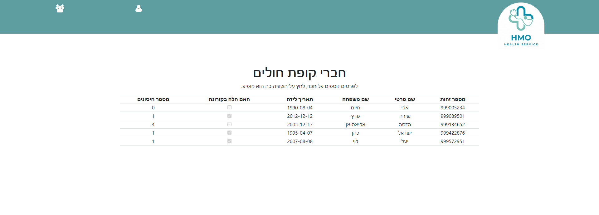
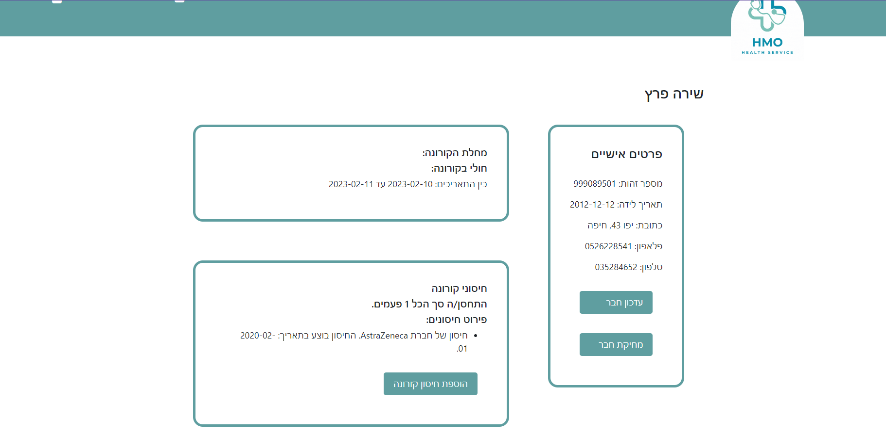
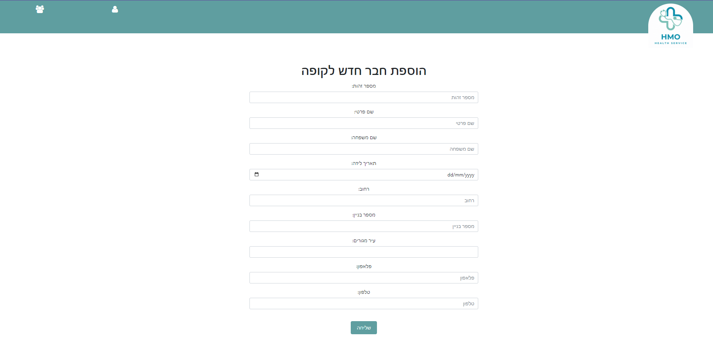
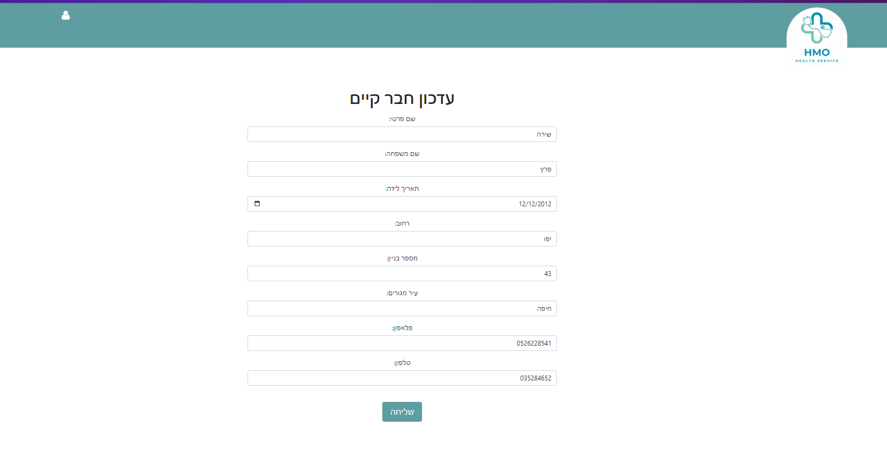
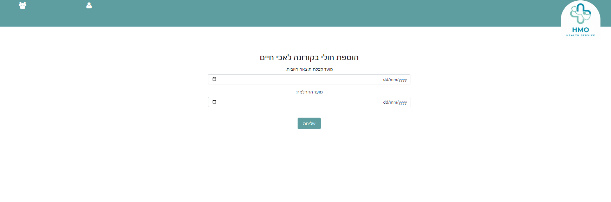

# Corona Database Management-HMO

This project is aimed at managing a health maintenance organization's database, including details related to the COVID-19 disease, such as vaccinations, infection dates, and recovery dates.

## Technologies Used

- Server-side:
  - C# with ASP.NET Web API
  - Visual Studio 2022

- Client-side:
  - Angular
  - Visual Studio Code

- Database:
  - SQL Server

## Installation Guide

1. **Download the Code from GitHub**:
   - Open the project page on GitHub: [Corona Database Management-HMO](https://github.com/Hadassa-E/HomeTest-H04).
   - Click on the "Code" button and then on "Download ZIP" to download the code to your computer.

2. **Installation with Visual Studio 2022**:
   - Extract the ZIP file you downloaded.
   - Open Visual Studio 2022 and import the project into the environment.

3. **Installation with Visual Studio Code**:
   - Extract the ZIP file you downloaded.
   - Open Visual Studio Code and select "File" > "Open Folder", then choose your project folder.

4. **Setting Up the Database**:
   - Have you created a database in SQL? Follow the appropriate instructions to import the project's database schema.

5. **Running the Local Server**:
   - If you're using a C# Web API, start the local server to begin working with the API.

6. **Running the Local Client**:
   - If you're using an Angular application, start the local client to begin working with the application.

## Contribution Guidelines

1. **Read Existing Source Code**: Before you start coding, read the existing code thoroughly to understand the project's structure, functionality, and existing features.

2. **Refer to Documentation**: Make sure to read and understand the documentation written for the project, including installation instructions, usage, and documentation on APIs and existing functions.

3. **Working with Git**: Make sure you're familiar with the correct workflow for working with Git and GitHub, including how to pull, push, commit, and resolve conflicts.

4. **Using Tools and Technologies**: Familiarize yourself with the tools and technologies used in the project, such as Visual Studio, Visual Studio Code, Angular, C#, SQL, and so on.

5. **Coding Styles and Design**: Ensure you're equipped with knowledge of proper coding styles and code design, such as MVC (Model-View-Controller) pattern and Clean Code principles.

6. **Unit and Integration Testing**: Make sure to perform unit tests and integration tests before each new release.

7. **Bug Fixes and Enhancements**: Try to integrate into the existing development process and contribute bug fixes and feature enhancements according to the existing list of tasks and issues.

8. **Collaboration**: Don't hesitate to ask questions and seek help from the existing team, and also contribute to discussions in the documentation and forums of the project.

## License

This project is distributed under the MIT License. See the LICENSE file for more information.

## Support

For questions, issues, or suggestions, please open an issue on GitHub.

## Installation Guide

1. **Download the Code from GitHub**:
   - Open the project page on GitHub: [Corona Database Management-HMO](https://github.com/Hadassa-E/HomeTest-H04).
   - Click on the "Code" button and then on "Download ZIP" to download the code to your computer.

2. **Installation with Visual Studio 2022**:
   - Extract the ZIP file you downloaded.
   - Open Visual Studio 2022 and import the project into the environment.

3. **Installation with Visual Studio Code**:
   - Extract the ZIP file you downloaded.
   - Open Visual Studio Code and select "File" > "Open Folder", then choose your project folder.

4. **Setting Up the Database**:
   - Have you created a database in SQL? Follow the appropriate instructions to import the project's database schema.

5. **Running the Local Server**:
   - If you're using a C# Web API, start the local server to begin working with the API.

6. **Running the Local Client**:
   - If you're using an Angular application, start the local client to begin working with the application.

**DAL Layer**
In this layer, I implemented database integration for the project and created CRUD functions to fetch data from each class (table) in the database.

**BLL Layer**
This layer handles validation checks for data input during record addition or update in the database. Additionally, I developed corresponding functions to those in the DAL layer, but here the functions accept and return DTO (Data Transfer Object) objects, which are the objects transmitted over the network.

**DTO Layer**
This layer facilitates the conversion between regular classes in the database and classes transferred over the network, which have no entity relationships.

**API Layer**
In this layer, server requests are processed, and all CRUD operations are executed. It orchestrates the functions from the BLL.

### City Table
-for Cities

### CoronaInfection Table
-for COVID-19 Infections

### Member Table
-for Health Insurance Members

### Vaccine Table
-for Vaccines 

### VaccineType Table
-for Vaccine Types

### Expanded Functionality Details
### Home Page:
- **Description**: The home page features a menu allowing navigation between all health insurance members and adding a new member to the health insurance.
- **Explanation**: The menu on the home page provides convenient access to all functionalities related to managing health insurance members.

### Members Page:
- **Description**: On this page, users can click on a specific member to view their details. Options are available for editing and deleting members.
- **Screenshot**: 
- **Screenshot**: 
- **Explanation**: Users can easily access and manage individual member details, including personal information and COVID-19 related data. If a member has contracted COVID-19, the dates of infection are displayed. Users can also add vaccination records for each member.

### Adding a Member:
- **Description**: Users have the option to add a new member to the health insurance.
- **Screenshot**: 
- **Explanation**: The "Add Member" feature allows users to enter the necessary information for a new health insurance member and save it to the database.

### Editing a Member:
- **Description**: Users can edit the details of an existing member.
- **Screenshot**: 
- **Explanation**: By selecting the "Edit" option on a member's details page, users can modify the information stored for that member and update it in the database.

### Adding a Vaccine to a Member:
- **Description**: Users can add vaccination records for a specific member.
- **Screenshot**: 
- **Explanation**: The "Add Vaccine" feature allows users to record vaccinations administered to a member, including the vaccine type and date of administration.

### Adding a COVID-19 Infection to a Member:
- **Description**: Users can record instances of COVID-19 infection for a member.
- **Screenshot**: 
- **Explanation**: The "Add Infection" feature allows users to specify if a member has contracted COVID-19, along with the date of infection.
